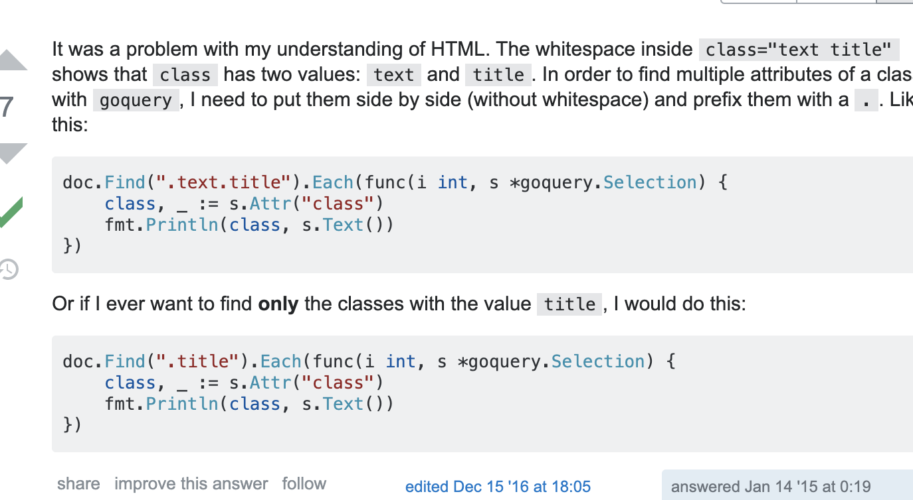

# record.md

삽질기의 기록

---

무언가를 처음 할 떄 는 할 줄 아는 것 부터 하며 방법을 구체화하는게 중요하다 

* 데이터를 구한다 !

* 그것을 학습하는 ai들 여러게 를 만든다.

자 그럼 데이터를 구해보자

주식에 대한 데이터는 어디에 있지? 어디에 있기는 인터넷상에 이미 까발려져 있다.

첫번째 목표

* 시간에 변화에 따른 주가

* 시간에 변화에 따른 시가총액

* 추가 예정

두번째 목표

* 데이터를 학습하자. (레이어 설정 및 딥러닝 설정)

* 삼성전자의 주가데이터를 70%는 학습용, 나머지 30%는 채점용 으로 나눠서 ai를 학습한다.

* 성적이 좋다면 3단계로 넘어간다.

세번째 목표

* aws에 올려서 docker로 나 없이 학습하고 데이터 모으고 하도록 만들자. (허허... 과연 이 단계가 올까..)

---

Tips goquery

---

<iframe name="day" src="/item/sise_day.nhn?code=005930" width="100%" height="360" marginheight="0" bottommargin="0" topmargin="0" scrolling="no" frameborder="0" title="일별 시세"></iframe>

src="/item/sise_day.nhn?code=005930"

일별시세

<iframe name="day" src="/item/sise_day.nhn?code=005930" width="100%" height="360" marginheight="0" bottommargin="0" topmargin="0" scrolling="no" frameborder="0" title="일별 시세"></iframe>
